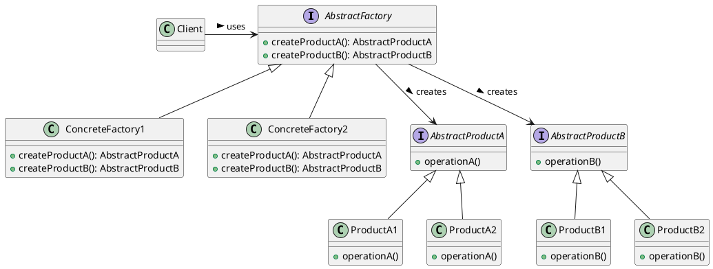
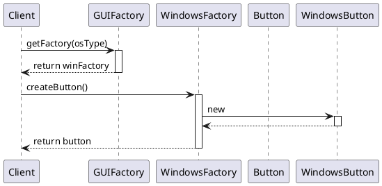

# Abstract Factory


The **Abstract Factory Design Pattern** is a creational pattern used for creating families of related or dependent objects without specifying their concrete classes. It enables a system to be independent of how its objects are created, composed, and represented.




### Intent

- To abstract the creation of families of related or dependent objects.
- To encapsulate a group of individual factories with a common goal without specifying their concrete classes.
- To make it easy to exchange product families by introducing new concrete factories.

### Structure

The pattern involves the following components:

1. **Abstract Factory**: Interface for creating abstract products.
2. **Concrete Factory**: Implements the operations to create concrete products.
3. **Abstract Product**: Interface for a type of product object.
4. **Concrete Product**: Implements the Abstract Product interface.
5. **Client**: Uses interfaces declared by Abstract Factory and Abstract Product classes.

### How It Works

1. The **Client** requests a product from the **Abstract Factory**.
2. The **Abstract Factory** delegates the creation request to a **Concrete Factory**.
3. The **Concrete Factory** creates and returns a **Concrete Product**.
4. The **Client** uses the returned product.


### Advantages

1. **Isolation of Concrete Classes**: Clients only need to work with interfaces and abstract classes, which promotes loose coupling.
2. **Exchange of Product Families**: Switching between different product families is simplified, as it's controlled by the instantiation of a specific factory class.
3. **Consistency Among Products**: Ensures that products meant to be used together are compatible.
4. **Supports Single Responsibility Principle**: By separating the concrete class creation from the client code.
5. **Supports Open/Closed Principle**: New variants of products can be introduced without altering existing client code.

### Disadvantages

1. **Complexity**: Introduces multiple layers of abstraction, potentially complicating the code base.
2. **Large Number of Classes**: May lead to an explosion of classes, especially with many product families.
3. **Difficulty in Supporting New Types of Products**: Extending the factory interface to produce new kinds of products can affect all its subclasses.

### Integration with Other Design Patterns

- **Factory Method**: Often implemented within Abstract Factories, Factory Methods encapsulate the creation of objects, with the Abstract Factory deciding the factory class.
- **Prototype**: An Abstract Factory might store a set of prototypes to clone and return product objects, offering flexibility in product instantiation.
- **Singleton**: Abstract Factories are frequently implemented as Singletons if a single, global access point for the factory is sufficient.
- **Builder**: Can be an alternative to Builder for constructing complex objects, especially when the product configurations are intricate.
- **Facade**: Abstract Factory may be used with Facade to provide a simple interface to a complex subsystem of factories, with the Facade defining a higher-level interface for ease of use.

The Abstract Factory Pattern can be effectively combined with these patterns, addressing various design challenges and requirements in application development.


### Example: UI Toolkit

Consider a UI toolkit needing to provide consistent widgets like buttons and checkboxes across multiple operating systems (Windows, MacOS, Linux). An abstract factory produces sets of related widgets, while concrete factories ensure widgets adhere to OS style guidelines.


#### Java Code Skeleton

```java
// Abstract Factory
public interface GUIFactory {
    Button createButton();
    Checkbox createCheckbox();
}

// Concrete Factories
public class WinFactory implements GUIFactory {
    public Button createButton() {
        return new WinButton();
    }
    public Checkbox createCheckbox() {
        return new WinCheckbox();
    }
}

public class MacFactory implements GUIFactory {
    public Button createButton() {
        return new MacButton();
    }
    public Checkbox createCheckbox() {
        return new MacCheckbox();
    }
}

// Abstract Products
public interface Button {
    void paint();
}
public interface Checkbox {
    void paint();
}

// Concrete Products
public class WinButton implements Button {
    public void paint() {
        System.out.println("Render a button in a Windows style");
    }
}
public class MacButton implements Button {
    public void paint() {
        System.out.println("Render a button in a Mac style");
    }
}
public class WinCheckbox implements Checkbox {
    public void paint() {
        System.out.println("Render a checkbox in a Windows style");
    }
}
public class MacCheckbox implements Checkbox {
    public void paint() {
        System.out.println("Render a checkbox in a Mac style");
    }
}

// Client code
public class Application {
    private Button button;
    private Checkbox checkbox;

    public Application(GUIFactory factory) {
        button = factory.createButton();
        checkbox = factory.createCheckbox();
    }

    public void paint() {
        button.paint();
        checkbox.paint();
    }
}

// Application configuration
public class ApplicationConfigurator {
    public static void main(String[] args) {
        GUIFactory factory;
        String osName = System.getProperty("os.name").toLowerCase();
        if(osName.contains("windows")) {
            factory = new WinFactory();
        } else if(osName.contains("mac")) {
            factory = new MacFactory();
        } else {
            throw new IllegalArgumentException("Unknown OS");
        }

        Application app = new Application(factory);
        app.paint();
    }
}
```
This approach allows the **Application** to abstract the process of creating UI elements that are consistent with the OS's style, promoting flexibility and scalability by decoupling client code from concrete implementations.


## Object Initialization Using the Abstract Factory Design Pattern


The application will use:
- An abstract factory interface (`GUIFactory`),
- Concrete factories (`WindowsFactory` and `MacOSFactory`),
- Product interfaces (`Button`, `Checkbox`),
- Along with their concrete implementations (`WindowsButton`, `MacOSButton`, `WindowsCheckbox`, `MacOSCheckbox`).




## Explanation of Object Initialization Sequence

1. **Client requests a factory:**
The client asks for a factory object based on the operating system type (`osType`). This is a simplification; typically, the client might check the system properties or configuration to decide which concrete factory to instantiate.

2.  **Factory returns WindowsFactory:**
The abstract factory (`GUIFactory`) returns an instance of `WindowsFactory` to the client. This step is abstracted as `getFactory(osType)` for simplicity. In a real implementation, this might involve a conditional check or a configuration setting.

3.  **Client requests a Button:**
The client then requests a `Button` object by calling `createButton()` on the `WindowsFactory`.

4.  **WindowsFactory creates WindowsButton:**
The concrete factory (`WindowsFactory`) instantiates a `WindowsButton`, which is a concrete implementation of the `Button` interface.

5.  **Factory returns Button to Client:**
Finally, the `WindowsButton` object is returned to the client as a `Button`. The client interacts with the button through the `Button` interface, remaining agnostic of the concrete implementation.

This sequence diagram outlines the object initialization process in an application using the Abstract Factory Design Pattern, showcasing how objects are created through abstract interfaces and concrete factory implementations, promoting loose coupling and scalability.
